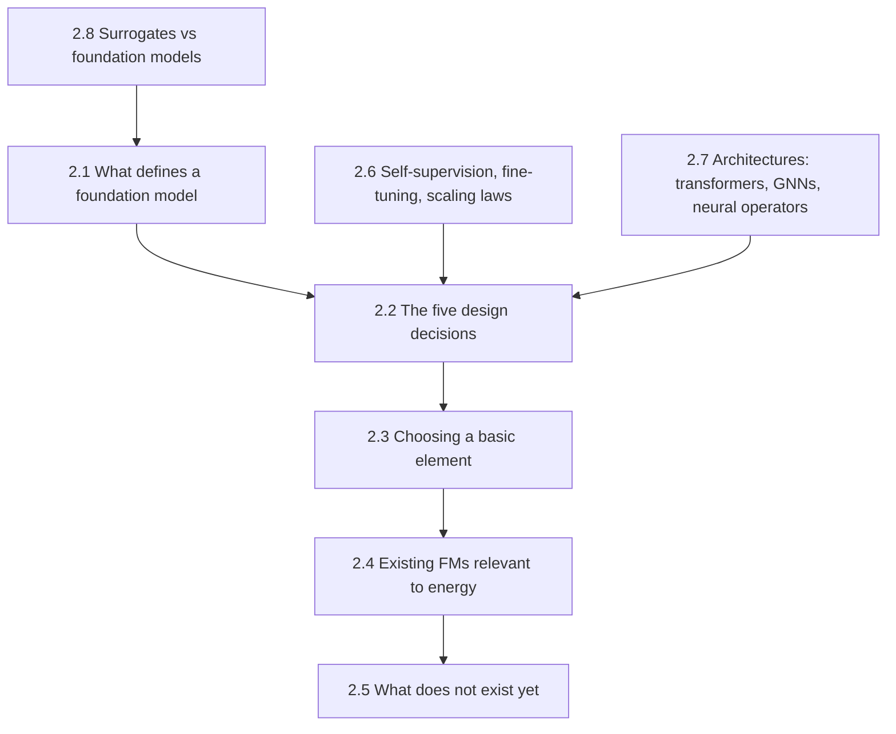

# Chapter 2 — Foundation Knowledge of Foundation Models
{: .no_toc }



The conceptual toolkit to judge any foundation-model proposal, including basic machine learning concepts for readers arriving from the energy-systems side.
{: .fs-6 .fw-300 }

## In this part

| § | Page | Covers |
| :--- | :--- | :--- |
| 2.1 | [What actually defines a foundation model](2-1-what-defines-an-fm.html) | Three required properties; surrogate vs FM |
| 2.2 | [The five design decisions](2-2-five-design-decisions.html) | Unit of observation, tokenisation, architecture, objective, evaluation |
| 2.3 | [Choosing a basic element](2-3-choosing-a-basic-element.html) | **The core argument** — a criterion for choosing a basic element, applied to buildings |
| 2.4 | [Existing FMs relevant to energy](2-4-existing-fms-relevant-to-energy.html) | Landing page for the sub-sections below |
| 2.4.1 | [— Time-series FMs](2-4-1-time-series-fms.html) | Chronos, Moirai, TimesFM, TabPFN-TS and the current generation |
| 2.4.2 | [— Power-grid FMs](2-4-2-power-grid-fms.html) | GridFM-v0 and the closest analogue to this book's project |
| 2.4.3 | [— Clean-energy forecasting FMs](2-4-3-clean-energy-forecasting-fms.html) | Multi-modal fusion for renewables forecasting |
| 2.4.4 | [— Tabular FMs](2-4-4-tabular-fms.html) | The cell as a basic element |
| 2.4.5 | [— Geospatial & weather FMs](2-4-5-geospatial-weather-fms.html) | GraphCast, Prithvi, and relevance to urban microclimate |
| 2.5 | [What does not exist yet](2-5-what-does-not-exist-yet.html) | The gaps this book is written into |
| 2.6 | [Self-supervised pretraining, fine-tuning, scaling laws](2-6-scaling-laws.html) | ML basics for readers without an ML background |
| 2.7 | [Architectures: transformers, GNNs, neural operators](2-7-architectures.html) | ML basics, continued |
| 2.8 | [Surrogates vs foundation models](2-8-surrogates-vs-fms.html) | The contrast UES readers already understand half of |

---
[← Previous: Chapter 1 — Background](../chapter-1-background/index.html) · [Next: Chapter 3 — Simulation and Optimisation in UES →](../chapter-3-sim-opt/index.html)
