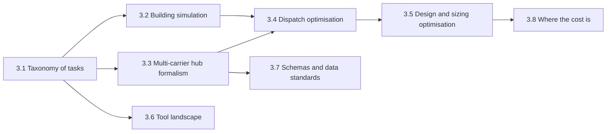

# Chapter 3 — Simulation and Optimisation in Urban Energy Systems
{: .no_toc }



The domain side, framed for an ML reader: what gets computed, with which tools, what shape the data has, and where the cost is.
{: .fs-6 .fw-300 }

## In this chapter

| § | Page | Covers |
| :--- | :--- | :--- |
| 3.1 | [Taxonomy of modelling tasks](3-1-taxonomy-of-tasks.html) | Nine tasks, their mathematical structure, typical runtime |
| 3.2 | [Building energy simulation: loads, datasets, benchmarks](3-2-building-simulation-data.html) | What's learnable, data shapes, benchmarks |
| 3.3 | [Multi-carrier energy hub formalism](3-3-energy-hub-formalism.html) | The formalism a hub FM must subsume or interoperate with |
| 3.4 | [Operation / dispatch optimisation](3-4-dispatch-optimisation.html) | LP/MILP dispatch as an ML problem shape |
| 3.5 | [Design and sizing optimisation](3-5-design-sizing-optimisation.html) | Bilevel structure, MILP/MINLP, the amortisation argument |
| 3.6 | [The tool landscape](3-6-tool-landscape.html) | Simulation, UBEM, optimisation and co-simulation tool families |
| 3.7 | [Schemas and data standards](3-7-schemas-and-standards.html) | ESDL, CIM, and why neither is ML-ready |
| 3.8 | [Where the computational cost actually is](3-8-where-the-cost-is.html) | Runtime brackets and the loops that matter |

---
[← Previous: Chapter 2 — Foundation Knowledge of FMs](../chapter-2-fm-foundations/index.html) · [Next: Chapter 4 — Directions for FMs in UES →](../chapter-4-directions/index.html)
