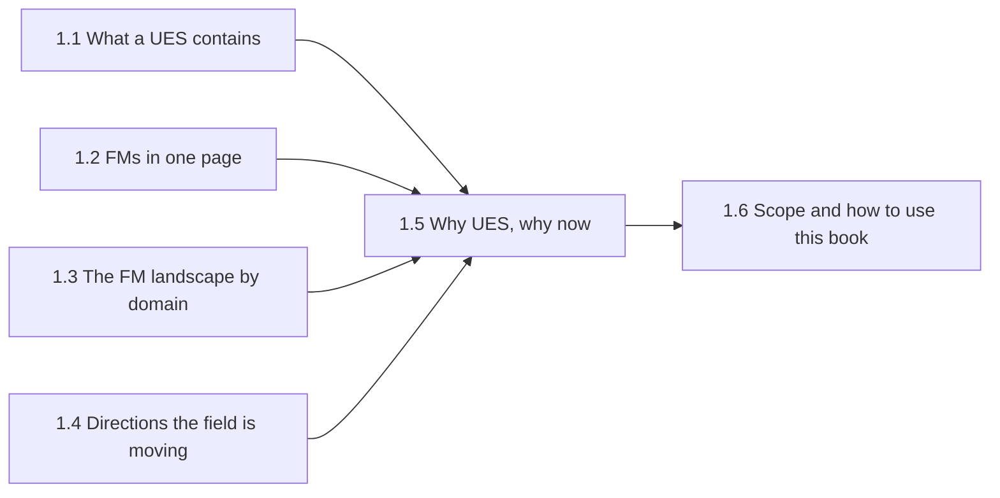

# Part 1 — Background: Urban Energy Systems and Foundation Models
{: .no_toc }



Orientation for a UES reader: what the domain is, what foundation models (FMs) are at a glance, and why the two fields should meet now.
{: .fs-6 .fw-300 }

## In this part

| § | Page | Covers |
| :--- | :--- | :--- |
| 1.1 | [What an urban energy system contains](1-1-what-is-ues.html) | Scales, carriers, the energy hub abstraction |
| 1.2 | [FMs in one page](1-2-fms-in-one-page.html) | What changed in AI since ~2018, in non-technical terms |
| 1.3 | [The FM landscape today, by domain](1-3-fm-landscape-by-domain.html) | Where foundation models exist across language, vision, weather, time series, graphs |
| 1.4 | [Directions the FM field is moving](1-4-fm-field-directions.html) | Convergence on decoder-only architectures, scaling laws, efficiency, synthetic pretraining |
| 1.5 | [Why UES, why now](1-5-why-ues-why-now.html) | The cost argument for bringing FMs to this domain |
| 1.6 | [Scope of this book and how to use it](1-6-scope-and-how-to-use.html) | What the book does and does not try to do |

---
[Back to Home](../index.html) · [Next: Part 2 — Foundation Knowledge of FMs →](../part-2-fm-foundations/index.html)
