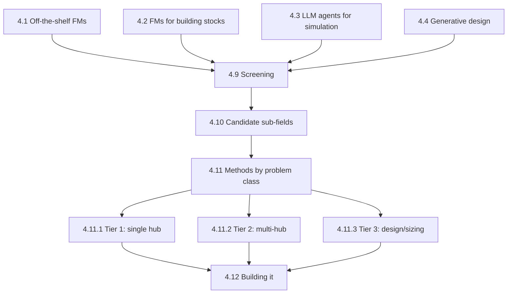

# Part 4 — Directions for Foundation Models in Urban Energy Systems
{: .no_toc }



A broad, neutral survey of which problems a foundation model could plausibly learn in this domain, and how — not one specific programme. For a single concrete proposal worked through in full depth, see [Part 5 — Case Study](../part-5-case-study/index.html).
{: .fs-6 .fw-300 }

{: .note }
**Part 4 vs Part 5.** This part surveys the field broadly: what's already usable off the shelf, which sub-fields pass a screening test, and the methods landscape by problem tier. It does not commit to one representation or one roadmap. [Part 5](../part-5-case-study/index.html) does exactly that, for one specific case — a foundation model for multi-carrier energy hubs.

## In this part

| § | Page | Covers |
| :--- | :--- | :--- |
| 4.1 | [Using existing FMs off the shelf](4-1-off-the-shelf-fms.html) | Zero-shot load forecasting with Chronos/TimesFM — the most useful direction to practitioners today |
| 4.2 | [FMs for whole building stocks](4-2-fms-for-building-stocks.html) | Stock-level rather than single-building representation |
| 4.3 | [LLMs and agents that build or run simulation models](4-3-llm-agents-for-simulation.html) | Natural-language model setup; ties to gap G7 |
| 4.4 | [Generative design](4-4-generative-design.html) | Generating candidate system designs rather than only evaluating them |
| 4.5 | [Screening: which sub-fields fit the FM pattern](4-5-screening-fields.html) | The FM-pattern fit test, applied at sub-field level |
| 4.6 | [Screening the tasks](4-6-screening-tasks.html) | The five-criterion screen applied to the T1–T9 taxonomy |
| 4.7 | [Reading the screen](4-7-reading-the-screen.html) | What the screen implies for where to invest |
| 4.8 | [Candidate sub-fields for a new FM](4-8-candidate-subfields.html) | Load FM, grid-load bridge, UBEM FM, weather-conditioned FM, hub FM |
| 4.9 | [Methods by problem class](4-9-methods-landing.html) | Landing page for the three tiers below |
| 4.9.1 | [— Tier 1: single hub, dispatch](4-9-1-methods-tier1.html) | Build path, baselines, architecture choice |
| 4.9.2 | [— Tier 2: multi-hub, multi-carrier](4-9-2-methods-tier2.html) | Graph neural networks, neural operators, topology generalisation |
| 4.9.3 | [— Tier 3: design and sizing](4-9-3-methods-tier3.html) | Amortised optimisation, feasibility guarantees, the decision-space problem |
| 4.10 | [Building it: data, physics, evaluation, budget](4-10-building-it.html) | Data generation, physics enforcement, evaluation protocol, realistic budgets |

---
[← Previous: Part 3 — Simulation and Optimisation in UES](../part-3-sim-opt/index.html) · [Next: Part 5 — Case Study →](../part-5-case-study/index.html)
