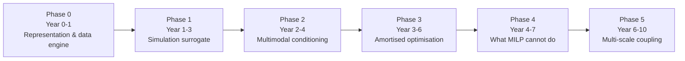

# 5.1 A Roadmap for a Multi-Carrier Energy Hub Foundation Model
{: .no_toc }



1. TOC
{:toc}

---

## Phase 0 (Year 0–1) — Representation and the data engine

The MATPOWER moment for multi-carrier systems, which does not currently exist (see [§3.6](../part-3-sim-opt/3-6-tool-landscape.html) and [§3.7](../part-3-sim-opt/3-7-schemas-and-standards.html)). Two deliverables:

- **A schema.** ESDL and CIM exist but neither is ML-ready (see [§3.7](../part-3-sim-opt/3-7-schemas-and-standards.html)).
- **A data-generation engine** that generates scenarios at scale, analogous to `gridfm-datakit` in power systems. Perturbation axes: demand profiles, technology portfolios, sizings, tariffs, carbon prices, weather years, network topology. Simulator-grounded UBEM tooling (e.g. CESAR-P, [§3.2](../part-3-sim-opt/3-2-building-simulation-data.html)) is the demand-side generator.
- **A canonical benchmark set** — the hub equivalent of PGLIB-OPF. Owning that benchmark is worth as much as owning the model — see [gap G4](../part-6-outlook/6-1-open-gaps.html#g4).

## Phase 1 (Year 1–3) — Simulation surrogate, deliberately not optimisation

Pretrain the masking task suite (see [§5.7](5-7-module-decomposition.html)) on simulated operation. Critically, train on **rule-based and perturbed-optimal dispatch**, not only cost-optimal dispatch. Cost-optimal dispatch is degenerate: many solutions achieve the same objective, so imitating a solver teaches an arbitrary tiebreak that will not generalise. Perturbing away from optimality gives a smooth, learnable manifold. See [risk 1](5-8-risks.html#581-five-risks-most-likely-to-kill-the-programme), label degeneracy.

## Phase 2 (Year 2–4) — Multimodal conditioning

Fuse demand, weather, technology, and market encoders (see [§5.7](5-7-module-decomposition.html)). Zero-shot transfer to unseen hub topologies becomes the headline metric, mirroring how grid foundation models evaluate on unseen grids ([§2.4.2](../part-2-fm-foundations/2-4-2-power-grid-fms.html), [§4.9.2](../part-4-directions/4-9-2-methods-tier2.html)). This is where a load FM (candidate sub-field in [§4.8](../part-4-directions/4-8-candidate-subfields.html)) stops being a separate project and becomes a component.

## Phase 3 (Year 3–6) — Amortised optimisation

Not replacing the MILP. Predicting warm starts, likely-active binaries, and reduced candidate technology sets, then handing them to the solver — Family 3 in [§4.9.3](../part-4-directions/4-9-3-methods-tier3.html). The metric is **solve-time reduction at a guaranteed optimality gap**, which is defensible to a power systems audience in a way that "our surrogate says 4% cheaper" never will be, and which structurally avoids design search adversarially exploiting surrogate error.

## Phase 4 (Year 4–7) — The things MILP cannot do

Thousands of stochastic scenarios, reliability criteria, uncertainty quantification, robust design under climate and price uncertainty. Also policy-lever parameterisation: search over subsidy levels, carbon prices, and retrofit rates rather than over nodal capacities, because the lever space is low-dimensional and the capacity space is not.

## Phase 5 (Year 6–10) — Multi-scale coupling

Hub FM ↔ grid FM. Hub aggregate demand is the grid's boundary condition; grid constraints and nodal prices are the hub's boundary condition. Today these are solved in separate tools with hand-passed interfaces. A shared representation is the genuinely novel scientific claim, and the natural long-horizon convergence point of this roadmap with the grid-load bridge FM direction named in [§4.8](../part-4-directions/4-8-candidate-subfields.html).

---
[← Back to Part 5](index.html) · [Next: 5.2 The Representation Problem →](5-2-representation-problem.html)
