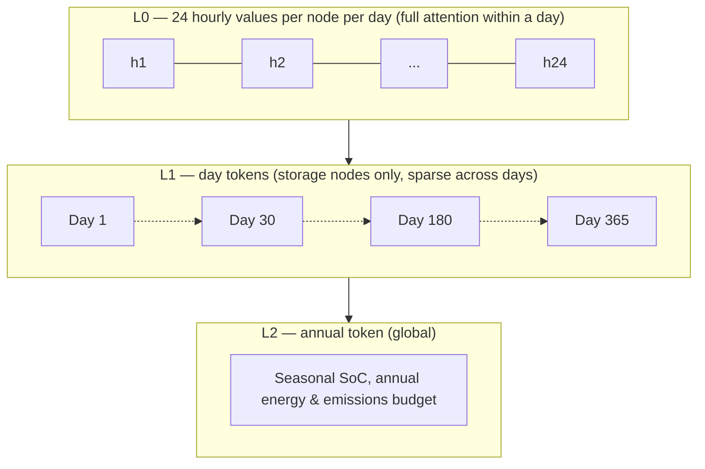

# 5.5 Token Schema and Temporal Hierarchy
{: .no_toc }



1. TOC
{:toc}

---

## 5.5.1 Token schema

```
CARRIER-BUS TOKEN
  static:
    carrier_class      embedding [elec, heat, cold, gas, H2, biomass, ambient]
    quality            normalized scalar (K for thermal, kV for elec, bar for gas)
    exergy_factor      derived scalar, gives the model conversion limits for free
    position           (x, y) or relative encoding
    is_boundary        bool
  per temporal patch:
    net_injection      normalized profile + log-magnitude scalar (two channels)
    shadow_price       from solver duals
    unserved           slack

DEVICE TOKEN
  static:
    tech_class         embedding from a closed vocabulary
    rated_capacity     per port
    eta_params         nominal efficiency + part-load coefficients
                       + temperature sensitivity (COP curve)
    ramp / min_up / min_down / min_part_load
    capex, opex, lifetime, embodied_emissions
    age, controllability
    state_active       bool — true for storage
  per temporal patch:
    port_throughput    per port
    part_load_fraction
    on_off
    availability
    state_of_charge    active only if state_active

EDGE TYPES
  device_port     device <-> carrier-bus, typed by role (in/out) and carrier
  transport       carrier-bus <-> carrier-bus, same carrier
                  (length, capacity, loss coeff, thermal time constant)
  quality_order   carrier-bus -> carrier-bus, same site, directed downward only
```

**Two choices worth defending explicitly:**

- **Storage is a device subtype, not a fourth node type.** Keeps the vocabulary at two, and `state_active` tells the attention mechanism which nodes need cross-day routing.
- **Two-channel normalisation** — normalised profile plus explicit log-magnitude. This is the direct fix for the information-deletion problem in [§5.2.1(f)](5-2-representation-problem.html#521-the-causal-chain-representation--data--capability). Carry both from the start; magnitude cannot be recovered later by fine-tuning.

## 5.5.2 Temporal hierarchy

| Level | Unit | Attention pattern | Carries |
| :--- | :--- | :--- | :--- |
| L0 | 24 hourly values, one token per node per day | Full attention across the graph within a day | Diurnal dispatch, conversion physics |
| L1 | Day tokens | Strided / sparse across days, **storage nodes only** | Weekly and seasonal charge cycles |
| L2 | One annual token | Global | Seasonal SoC, annual energy and emissions budget |



This hierarchy exists to solve the context-ceiling problem in [§5.2.1(d)](5-2-representation-problem.html#521-the-causal-chain-representation--data--capability): a flat year of hourly tokens per node is intractable, but full attention is only needed within a day, and cross-day routing only needed for storage nodes.

## 5.5.3 Masking tasks mapped onto the tokens

| Task | What is masked | What it teaches |
| :--- | :--- | :--- |
| M1 | Carrier-bus injections for a day | Balance-solving — the power-flow analogue |
| M2 | Device throughput | Dispatch behaviour |
| M3 | Device static attributes (capacity, η) | Attribute inference |
| M4 | A device-port edge | Which technology plausibly connects these carriers |
| M5 | Future window | Rollout |
| M6 | **Mid-year storage SoC trajectory** | Seasonal reasoning — the distinctive one, and the first to fail if the hierarchy is wrong |

These map directly onto the pretraining task suite (P1–P4) in [§5.7](5-7-module-decomposition.html).

## 5.5.4 Invariances

- Permutation over nodes (from the graph structure)
- Scale (from two-channel normalisation)
- Carrier-quality ordering (structural, via directed downgrade edges)
- **Not** time-shift — diurnal and seasonal phase matter, so absolute time-of-day and day-of-year must be encoded

## 5.5.5 Minimum viable v0

Ship this first, prove the premise, then add:

- Single site, no spatial network (drop transport edges)
- Three carriers, two heat quality levels
- No seasonal storage, no L1/L2 hierarchy — day-level tokens only
- M1 and M2 only
- Fixed device vocabulary of ~8 classes

If that does not beat a tuned reduced-order model on held-out device configurations, the representation is wrong — learned in months rather than years. See [risk 5](5-8-risks.html#581-five-risks-most-likely-to-kill-the-programme).

---
[← Previous: 5.4 A Concrete Proposed Representation](5-4-concrete-representation.html) · [Next: 5.6 Physics Loss →](5-6-physics-loss.html)
