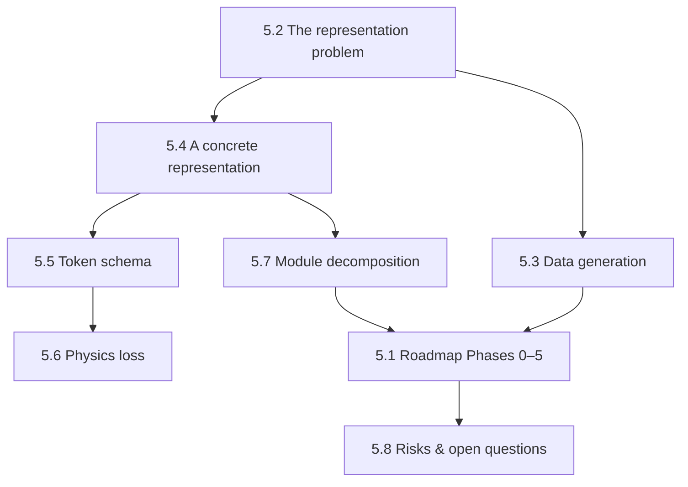

# Part 5 — Case Study: A Foundation Model for Multi-Carrier Energy Hubs
{: .no_toc }



One specific, opinionated proposal, worked through in full technical depth: representation, token schema, module decomposition, a phased roadmap, and the risks that could kill it.
{: .fs-6 .fw-300 }

{: .note }
**This part is a case study, not a survey.** It commits to one representation and one roadmap, where [Part 4](../part-4-directions/index.html) deliberately stayed neutral across many directions. Treat everything here as one group's specific bet, argued in full — not as "what the field has established."

## In this part

| § | Page | Covers |
| :--- | :--- | :--- |
| 5.1 | [A roadmap for a multi-carrier energy hub FM](5-1-roadmap.html) | Phases 0–5, from representation to multi-scale coupling |
| 5.2 | [The representation problem](5-2-representation-problem.html) | Why representation is four decisions, and the causal chain from representation to capability |
| 5.3 | [Data generation](5-3-data-generation.html) | Sampling design specific to the case study |
| 5.4 | [A concrete proposed representation](5-4-concrete-representation.html) | Bipartite graph of carrier-bus and device tokens, worked 50-building example |
| 5.5 | [Token schema and temporal hierarchy](5-5-token-schema.html) | The full schema, masking tasks, invariances, minimum viable v0 |
| 5.6 | [Physics loss](5-6-physics-loss.html) | The physics-loss inventory attached to the tokens |
| 5.7 | [Module and task decomposition](5-7-module-decomposition.html) | Encoders, pretraining tasks, downstream benchmark suite |
| 5.8 | [Risks and unsettled design questions](5-8-risks.html) | Five risks most likely to kill the programme; three unsettled questions |

---
[← Previous: Part 4 — Directions for FMs in UES](../part-4-directions/index.html) · [Next: Part 6 — Outlook →](../part-6-outlook/index.html)
